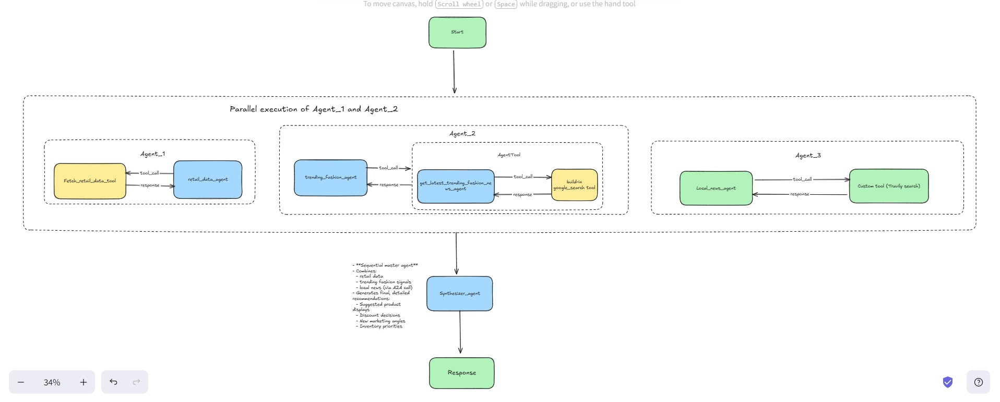
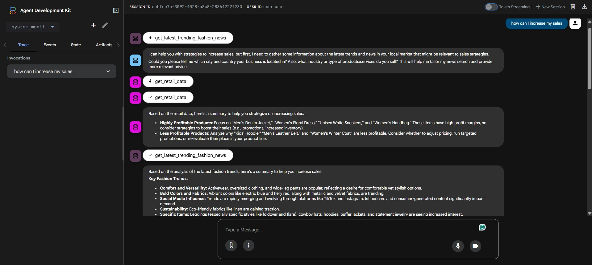
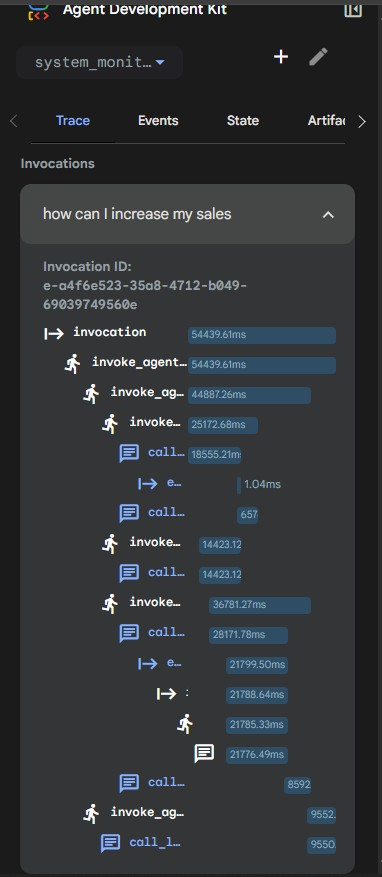
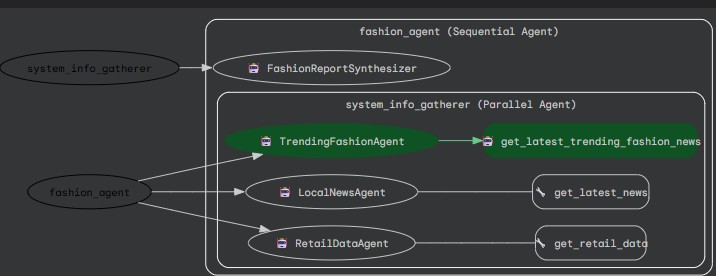

# kaggle_capstone_project


# 🧵 Fashion Advisor — Multi-Agent, LLM-Powered Retail Intelligence System

## Problem Statement

Fashion retail moves incredibly fast, and most small and mid-size stores struggle to keep up with the pace of changing trends and customer preferences. Store owners often make merchandising and discount decisions based on intuition, fragmented data, or outdated information.

This leads to several enterprise-level challenges:

* **`Inventory misalignment`** – Overstocking slow sellers and under-promoting trending items
* **`Inefficient merchandising`** – Displays and promotions that don’t reflect current demand
* **`Slow reaction to local events`** – Missing opportunities tied to festivals, weather, or community happenings
* **`Low data visibility`** – No integrated way to combine sales, trends, and market signals

These issues directly reduce sales, increase waste, and limit competitive advantage. Retailers need a system that continuously monitors trends, local context, and store performance to guide merchandising decisions in real time.

## Proposed Solution

I built a multi-agent retail intelligence system called **`Fashion Advisor`**, designed to help fashion stores increase sales by aligning their merchandising with real-time trends and local market conditions.

> **`retail_data_agent`** – Analyzes store sales, profitability, and product performance.
> **`trending_fashion_agent`** – Uses an internal AgentTool **`get_latest_trending_fashion_news`** to gather the latest global fashion news and trend signals.
> **`local_news_agent`** – Monitors local events, holidays, weather updates, and regional news that may affect demand.
> **`synthesizer_agent`** – Combines insights from all agents and produces a final, actionable recommendation report, such as what to display, what to discount, and which categories to highlight.

The result is a dynamic, automated advisor that behaves like a virtual team of analysts, providing real-time, revenue-focused merchandising suggestions for fashion retailers.

---

## 🚀 Key Capabilities

- **LLM-powered agents** (Gemini) orchestrated as both *parallel* and *sequential workflows*  
- **Custom tools + Built-in Google Search (google-adk)** for data retrieval and analysis  
- **Session & state management** using `InMemorySessionService`  
- **Context engineering**, including **context compaction**, to efficiently manage long inputs  
- **Observability** using logs, traces, and metrics  
- **Automatic agent evaluation** for quality and correctness  
- **A2A (Agent-to-Agent) protocol** for cross-agent communication

---

## 📂 Project Structure

```
11-parallel-agent/
└── fashion_advisor/
    ├── __init__.py
    └── subagents/
        ├── __init__.py
        ├── get_latest_trending_fashion_news/
        │   └── agent.py
        ├── local_news_agent/
        │   ├── __init__.py
        │   ├── agent.py
        │   └── tools.py
        ├── retail_data_agent/
        │   ├── __init__.py
        │   ├── agent.py
        │   └── tools.py
        ├── synthesizer_agent/
        │   ├── __init__.py
        │   └── agent.py
        └── trending_fashion_agent/
            ├── __init__.py
            ├── agent.py
            └── tools.py
         agent.py
   agent_for_a2a/
   ├── __init__.py
   ├── a2a_server.py
   ├── agent.py
   └── test_a2a.py
README.md
requirements.txt
```

---

## 🧠 System Architecture


The Fashion Advisor uses **five major agents**, each powered by **Google Gemini models**, working together to produce a final, actionable sales strategy.

### 🔹 1. `retail_data_agent`
- Analyzes store sales history  
- Identifies profitable / underperforming products  
- Uses custom tools defined in `tools.py`

### 🔹 2. `trending_fashion_agent`
- Fetches trending fashion news  
- Uses a custom tool: [`get_latest_trending_fashion_news`]  
- Integrates the built-in **Google Search tool**

### 🔹 3. `get_latest_trending_fashion_news` (Tool Agent)
- A dedicated agent acting as a tool interface  
- Performs live queries to gather trending fashion insights

### 🔹 4. `synthesizer_agent`
- **Sequential master agent**  
- Combines:
  - retail data  
  - trending fashion signals  
  - local news (via A2A call)
- Generates final, detailed recommendations:
  - Suggested product displays  
  - Discount decisions  
  - New marketing angles  
  - Inventory priorities

### 🔹 5. `local_news_agent`
- Receives calls via **A2A Protocol** from `synthesizer_agent`  
- Retrieves current local news to check:
  - economic events  
  - weather effects  
  - festivals  
  - location-specific factors that may affect retail sales  


Below is the data flow diagram, how the information flow through the system.


---

## ⚙️ Workflow Orchestration

### 🟦 Parallel Agents
- `trending_fashion_agent`, `retail_data_agent`, and local news queries run in **parallel** for high speed.

### 🟥 Sequential Agents
- The `synthesizer_agent` runs **after** the parallel agents finish.  
- It then triggers `local_news_agent` via A2A for additional context.

---

## 🧩 Custom Tools & Built-In Tools

### Custom Tools
- Implemented in each agent’s `tools.py`
- Examples:
  - Retail sales data fetchers  
  - Local news fetchers  
  - Internal data transformations

### Built-in Tools (google-adk)
- **Google Search** for real-time fashion trends and local news  
- **Code Execution** (if enabled) for data computations

All tools have been validated and tested within the agent workflows.

---

## 🔒 Sessions & State Management

### ✔ `InMemorySessionService`
- Maintains conversation state across agent cycles  
- Enables session continuity for repeated analysis

### ✔ Long-Term Memory
- Stores:
  - historical recommendations  
  - trending patterns  
  - recurring season-specific insights  
- Enables agents to reason across long-running retail operations

---

## 🧱 Context Engineering

The system uses:

- **Context compaction**  
- **Memory-aware prompt building**  
- **Selective past recall**  
- **Token-efficient summarization**

…to ensure that the agents maintain high performance even as the context grows.

---

## 🛡 Observability

The system includes:

### 🔍 Logging
- Each agent logs:
  - tool calls  
  - network requests  
  - errors  
  - decisions made

### 📈 Tracing
- End-to-end traceability of agent workflow  
- Parallel vs sequential step monitoring  
- A2A call tracing

### 📊 Metrics
- Execution time  
- Tool usage frequency  
- Model response latency  
- Evaluation pass/fail scores

---

## 🧪 Agent Evaluation

- All agents have been tested using custom evaluation routines  
- Ensures:
  - Tool correctness  
  - Stable interactions  
  - Reliable sequential orchestration  
  - Proper memory usage  
  - Accurate synthesis in final output

Test suite includes: `test_a2a.py` and internal agent-level tests.

---

## 🔁 A2A Protocol (Agent-to-Agent Communication)

The **A2A server** (see `agent_for_a2a/a2a_server.py`) enables:

- Agents to call other agents *as functions*  
- Secure and structured payload transfer  
- Real-time local news retrieval triggered by `synthesizer_agent`

This allows dynamic, cross-agent collaboration without breaking the workflow.

---

## ▶️ Running the Fashion Advisor

1. Install requirements:

```bash
pip install -r requirements.txt
```

2. Now, navigate inside folder agent_for_a2a and run below command

```bash
uvicorn agent:app --host localhost --port 8001
```

You should see that the agent must be listening on 8001 port

```code
Product Catalog Agent is now A2A-compatible!
Agent will be served at: http://localhost:8001
Agent card will be at: http://localhost:8001/.well-known/agent-card.json
```

3. Test s2s agent by running below command

```bash
python test_a2a.py
```

You will get an agent card like below


4. Now to run the workflow end-to-end, navigate inside folder 11-parallel-agent and run below command

```bash
adk web
```
You will see a UI in which you can ask questions like below


5. Navigate to 'events' to check all the events.


Click on any event to see the whole flow


6. Now navigate back to terminal and navgate back to folder 11-parallel-agent and open file agent.py. In that file one will see different sections that shows different functionalities in action. 

* For logging and debugging uncomment line no. 179 and run the file using below command.

```bash
python -m system_monitor_agent.agent.py
```

For logging, I have used ADK's built-in `LoggingPlugin`

In this we don't have to define all the callbacks and plugins to capture *standard* Observability data in ADK. Instead, ADK provides a built-in **LoggingPlugin** that automatically captures all agent activity:

- 🚀 User messages and agent responses
- ⏱️ Timing data for performance analysis
- 🧠 LLM requests and responses for debugging
- 🔧 Tool calls and results
- ✅ Complete execution traces

Once you run the script, you must see logs which will help you debug the agent. Below are some screenshots of logs.


* I have also implemented Sessions and Memory.

- **Session** = A notebook 📓
- **Events** = Individual entries in a single page 📝
- **SessionService** = The filing cabinet storing notebooks 🗄️
- **Runner** = The assistant managing the conversation 🤖

I have implemented Session Management option (`InMemorySessionService`):

`InMemorySessionService` is temporary. **Once the application stops, all conversation history is lost.** 

For Persistent Sessions I have used `DatabaseSessionService`. Once, you run the script for session and memory, you will see a db file created in the directory.


| Service | Use Case | Persistence | Best For |
|---------|----------|-------------|----------|
| **InMemorySessionService** | Development & Testing | ❌ Lost on restart | Quick prototypes |
| **DatabaseSessionService** | Self-managed apps | ✅ Survives restarts | Small to medium apps |
| **Agent Engine Sessions** | Production on GCP | ✅ Fully managed | Enterprise scale |

And also to check the data present inside the the db file, you can uncomment line no. 195 and run code below command

```bash
python -m system_monitor_agent.agent.py
```

OR 

you can use below code to check the text present in the db file.

```markdown
def check_data_in_db():
    with sqlite3.connect("my_agent_data.db") as connection:
        cursor = connection.cursor()
        result = cursor.execute(
            "select app_name, session_id, author, content from events"
        )
        print([_[0] for _ in result.description])
        for each in result.fetchall():
            print(each)
```
### Context Engineering

For context engineering check below attacked kaggle notebook link that explains the concept of data compaction in deep.

[Kaggle Notebook: Context Engineering](https://www.kaggle.com/code/jaypathak08/context-engineering)


# Fashion Advisor (Version 2) 

## Below is another version that executes `local_news_agent` parallely

---

## 🧠 System Architecture



The Fashion Advisor uses **five major agents**, each powered by **Google Gemini models**, working together to produce a final, actionable sales strategy.

### 🔹 1. `retail_data_agent`
- Analyzes store sales history  
- Identifies profitable / underperforming products  
- Uses custom tools defined in `tools.py`

### 🔹 2. `trending_fashion_agent`
- Fetches trending fashion news  
- Uses a custom tool: [`get_latest_trending_fashion_news`]  
- Integrates the built-in **Google Search tool**

### 🔹 3. `get_latest_trending_fashion_news` (Tool Agent)
- A dedicated agent acting as a tool interface  
- Performs live queries to gather trending fashion insights

### 🔹 4. `local_news_agent`
- Fetches local news 
- Uses custom tools defined in `tools.py` which uses `travvilysearch` web search tool. 

### 🔹 5. `synthesizer_agent`
- **Sequential master agent**  
- Combines:
  - retail data  
  - trending fashion signals  
  - local news
- Generates final, detailed recommendations:
  - Suggested product displays  
  - Discount decisions  
  - New marketing angles  
  - Inventory priorities


Below is the data flow diagram, how the information flow through the system.


---

## ⚙️ Workflow Orchestration

### 🟦 Parallel Agents
- `trending_fashion_agent`, `retail_data_agent`, and `local_news_agent` queries run in **parallel** for high speed.

### 🟥 Sequential Agents
- The `synthesizer_agent` runs **after** the parallel agents finish.

---

## ▶️ Running the Fashion Advisor (version 2)

1. Install requirements:

```bash
pip install -r requirements.txt
```

2. Now to run the workflow end-to-end, navigate inside folder 11-parallel-agent and run below command

```bash
adk web
```
You will get web UI like below in which you can input your query.

3. Once you fire a query, you will see all the agents in action.



4. By clicking on the `Trace` section, you can see the detailed view of flow.



5. Navigate to events and click on any event to check the flow.


